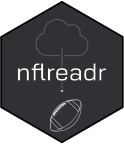

<!-- README.md is generated from README.Rmd. Please edit that file -->

# nflreadr <a href='https://nflreadr.nflverse.com'></a>

<!-- badges: start -->

[](https://CRAN.R-project.org/package=nflreadr)
[](https://app.codecov.io/gh/nflverse/nflreadr?branch=main)
[](https://nflreadr.nflverse.com/)
[](https://lifecycle.r-lib.org/articles/stages.html)
[](https://github.com/nflverse/nflreadr/actions)
[](https://discord.com/invite/5Er2FBnnQa)

<!-- badges: end -->

nflreadr is a minimal package for downloading data from nflverse
repositories. It includes caching, optional progress updates, and data
dictionaries.

Please note that nflverse data repositories have been reorganized and
pushed towards the
[nflverse-data](https://github.com/nflverse/nflverse-data) repo, and
v1.2.0+ is the minimum version that supports this change. We encourage
all users to upgrade to this version immediately.

For Python access to nflverse data, please check out
[nflreadpy](https://nflreadpy.nflverse.com).

## Installation

Install the stable version from CRAN with:

``` r
install.packages("nflreadr")
```

Install the development version from GitHub with:

``` r
install.packages("nflreadr", repos = c("https://nflverse.r-universe.dev", getOption("repos")))

# or use remotes/devtools
# install.packages("remotes")
remotes::install_github("nflverse/nflreadr")
```

## Usage

The main functions of `nflreadr` are prefixed with `load_`.

``` r
library(nflreadr)

load_pbp(2021)
#> ── nflverse play by play data ──────────────────────────────────────────────────
#> ℹ Data updated: 2026-01-08 14:12:35 CET
#> # A tibble: 49,922 × 372
#>    play_id game_id     old_game_id home_team away_team season_type  week posteam
#>      <dbl> <chr>       <chr>       <chr>     <chr>     <chr>       <int> <chr>  
#>  1       1 2021_01_AR… 2021091207  TEN       ARI       REG             1 <NA>   
#>  2      40 2021_01_AR… 2021091207  TEN       ARI       REG             1 TEN    
#>  3      55 2021_01_AR… 2021091207  TEN       ARI       REG             1 TEN    
#>  4      76 2021_01_AR… 2021091207  TEN       ARI       REG             1 TEN    
#>  5     100 2021_01_AR… 2021091207  TEN       ARI       REG             1 TEN    
#>  6     122 2021_01_AR… 2021091207  TEN       ARI       REG             1 TEN    
#>  7     152 2021_01_AR… 2021091207  TEN       ARI       REG             1 ARI    
#>  8     181 2021_01_AR… 2021091207  TEN       ARI       REG             1 ARI    
#>  9     218 2021_01_AR… 2021091207  TEN       ARI       REG             1 ARI    
#> 10     253 2021_01_AR… 2021091207  TEN       ARI       REG             1 ARI    
#> # ℹ 49,912 more rows
#> # ℹ 364 more variables: posteam_type <chr>, defteam <chr>, side_of_field <chr>,
#> #   yardline_100 <dbl>, game_date <chr>, quarter_seconds_remaining <dbl>,
#> #   half_seconds_remaining <dbl>, game_seconds_remaining <dbl>,
#> #   game_half <chr>, quarter_end <dbl>, …

load_player_stats(2021)
#> ── nflverse player stats: week level ───────────────────────────────────────────
#> ℹ Data updated: 2026-01-08 14:15:10 CET
#> # A tibble: 18,969 × 114
#>    player_id  player_name      player_display_name position position_group
#>    <chr>      <chr>            <chr>               <chr>    <chr>         
#>  1 00-0019596 T.Brady          Tom Brady           QB       QB            
#>  2 00-0022824 A.Lee            Andy Lee            P        SPEC          
#>  3 00-0022924 B.Roethlisberger Ben Roethlisberger  QB       QB            
#>  4 00-0023252 R.Gould          Robbie Gould        K        SPEC          
#>  5 00-0023459 Aa.Rodgers       Aaron Rodgers       QB       QB            
#>  6 00-0023682 R.Fitzpatrick    Ryan Fitzpatrick    QB       QB            
#>  7 00-0023853 M.Prater         Matt Prater         K        SPEC          
#>  8 00-0024243 M.Lewis          Marcedes Lewis      TE       TE            
#>  9 00-0024417 S.Koch           Sam Koch            P        SPEC          
#> 10 00-0025565 N.Folk           Nick Folk           K        SPEC          
#> # ℹ 18,959 more rows
#> # ℹ 109 more variables: headshot_url <chr>, season <int>, week <int>,
#> #   season_type <chr>, team <chr>, opponent_team <chr>, completions <int>,
#> #   attempts <int>, passing_yards <int>, passing_tds <int>, …
```

## Data Sources

Data accessed by this package is stored on GitHub and can typically be
found in one of the following repositories:

- [nflverse/nflverse-data](https://github.com/nflverse/nflverse-data)
- [nflverse/nfldata](https://github.com/nflverse/nfldata)
- [nflverse/espnscrapeR-data](https://github.com/nflverse/espnscrapeR-data)
- [dynastyprocess/data](https://github.com/dynastyprocess/data)
- [ffverse/ffopportunity](https://github.com/ffverse/ffopportunity)

For a full list of functions, please see the [reference
page](https://nflreadr.nflverse.com/reference/index.html).

This data is maintained by the nflverse project team and is primarily
automated via GitHub Actions. You can check the status and schedules
page here: <https://github.com/nflverse/nflverse-data>

## Configuration

The following options help configure default `nflreadr` behaviours.

``` r
options(nflreadr.verbose) 
# TRUE/FALSE to silence messages such as cache warnings
options(nflreadr.cache) 
# one of "memory", "filesystem", or "off"
options(nflreadr.prefer) 
# one of "rds", "parquet", or "csv"
options(nflreadr.download_path)
# defaults to current working directory - change to specify where `nflverse_download()` places data.
```

You can also configure `nflreadr` to display progress messages with the
[`progressr` package](https://progressr.futureverse.org), e.g.

``` r
progressr::with_progress(load_rosters(seasons = 2010:2020))
 |========            |  40%
```

## Getting help

The best places to get help on this package are:

- the [nflverse discord](https://discord.com/invite/5Er2FBnnQa) (for
  both this package as well as anything R/NFL related)
- opening [an
  issue](https://github.com/nflverse/nflreadr/issues/new/choose)

## Contributing

Many hands make light work! Here are some ways you can contribute to
this project:

- You can [open an
  issue](https://github.com/nflverse/nflreadr/issues/new/choose) if
  you’d like to request specific data or report a bug/error.

- If you’d like to contribute code, please check out [the contribution
  guidelines](https://nflreadr.nflverse.com/CONTRIBUTING.html).

## Terms of Use

The R code for this package is released as open source under the [MIT
License](https://nflreadr.nflverse.com/LICENSE.html). NFL data accessed
by this package belong to their respective owners, and are governed by
their terms of use.
